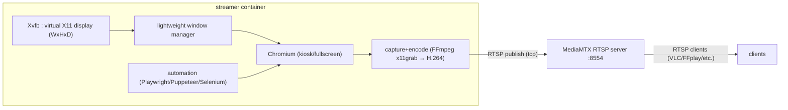
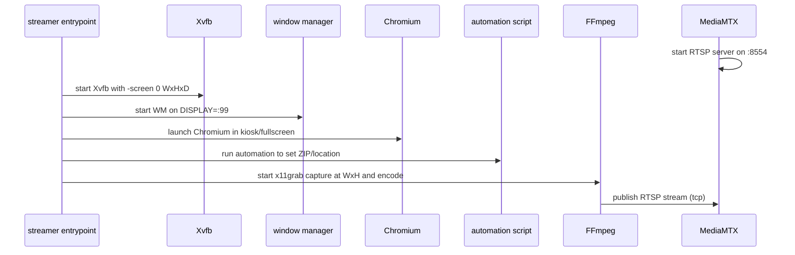

# Dockerized Browser Rendering to RTSP for Weather.com RetroCast

## Executive summary

A practical way to build a Docker-based system that loads `weather.com/retro`, renders the experience “full-screen,” programmatically selects a ZIP code (or another location mechanism), captures the rendered frames at a declared resolution (e.g., 1920×1080 or 1280×720), and provides an RTSP stream is to treat the problem as a **render → capture → encode → publish** pipeline. The most dependable approach in containers is a **virtual X11 display** (Xvfb) hosting a non-headless browser window, captured by FFmpeg (or GStreamer), and published to a dedicated RTSP media server such as MediaMTX. Xvfb explicitly supports creating a virtual screen at a chosen width/height/depth. citeturn19view0

A second, “no-X11” architecture is possible by using **Chrome DevTools Protocol (CDP) screencasting** (`Page.startScreencast`) from a headless Chromium instance and pushing those frames into an encoder that publishes to RTSP. This can reduce container complexity (no Xvfb/window manager), but CDP screencast is marked *Experimental* and is commonly more CPU-intensive due to rapid image encoding/transport (JPEG/PNG frames) compared to grabbing raw pixels from a framebuffer. citeturn25search0

For RTSP serving, **MediaMTX** is a strong default: it is “ready-to-use,” supports publishing and reading streams via RTSP, and provides an official Docker image with guidance for container networking, including disabling RTSP/UDP in Docker environments (use RTSP/TCP) and multiple image variants. citeturn21view0turn20view0 FFmpeg supports RTSP output and allows selecting RTSP lower transport (UDP vs TCP). citeturn10search0

Two non-technical constraints can dominate the design:

- **Shared memory / IPC stability for Chromium in containers.** The Playwright Docker guidance explicitly recommends `--ipc=host` for Chromium because otherwise it can run out of memory and crash. citeturn29search0
- **Licensing and legal constraints for capturing/streaming Weather Channel content.** The Terms of Use for entity["organization","The Weather Channel","weather media company"]’s streaming service include strong prohibitions against reproducing, streaming, capturing, broadcasting, or using bots/scrapers without express written permission. This raises a real risk that a system that “captures rendered output” and “exposes it as an RTSP stream” violates content terms unless you have explicit rights. citeturn28view0

**Recommended baseline architecture (most robust):**  
Xvfb (virtual display sized to your target resolution) + lightweight window manager + Chromium in kiosk/fullscreen + Playwright/Puppeteer DOM automation to set location + FFmpeg `x11grab` capture + H.264 encode + MediaMTX RTSP server (RTSP over TCP).

**Alternative architecture (simpler topology, higher engineering risk):**  
Headless Chromium + CDP `Page.startScreencast` → pipe frames to FFmpeg → publish to MediaMTX RTSP.

## Scope, requirements, and constraints

The requested capability set implies the following functional requirements:

- Start a browser session to `weather.com/retro` (or the “RetroCast Now” entry point). citeturn23search1turn22view0
- Render at deterministic pixel dimensions (examples requested: 1920×1080 and 1280×720).
- Programmatically set or select a location (ZIP code or other location input).
- Capture frames at that resolution, encode as a live video stream, and publish as RTSP.
- Run in Docker/Compose, with restart resilience and observability.

Non-functional constraints that materially shape the engineering choices:

- **“Full-screen” in a container typically means either:**
  - (a) a “headful” browser window that fills a virtual display (Xvfb + window manager), or
  - (b) a “headless” browser with a fixed viewport sized to the target resolution (CDP screencast or synthetic frames).
- **RTSP over TCP is often preferable in Docker.** MediaMTX’s Docker documentation explicitly calls out RTSP/UDP complications with Docker networking and suggests using RTSP/TCP unless using host networking. citeturn21view0
- **Process supervision matters** because “browser + automation + capture + streaming” is multi-process. Docker documentation notes that adding an init process (`--init`) helps properly reap child processes and reduce zombie-process issues. citeturn30search23turn29search0
- **Rights/terms may prohibit the entire approach** if you do not have permission. The terms excerpt explicitly prohibits “stream, capture… broadcast… or transmit” the service/content and prohibits automated access by bots/scrapers without written permission. citeturn28view0

## Architecture options for rendering and control

### Headful virtual display pipeline

A common container pattern is:

1. Run **Xvfb** to create a virtual screen (`-screen screennum WxHxD`); the Debian manpage shows the option and even the default screen dimensions. citeturn19view0  
2. Run a lightweight window manager (Openbox/Fluxbox/etc.).
3. Launch Chromium “fullscreen/kiosk” to the target URL.
4. Use Playwright/Puppeteer/Selenium to interact with the DOM and set location.
5. Run FFmpeg or GStreamer to capture the X11 framebuffer and publish to RTSP.

This is usually the most predictable for “full-screen capture” because you explicitly control the virtual display’s resolution at the X server level. citeturn19view0

Optional debugging layer:
- **x11vnc** can provide VNC access to an existing X11 display. citeturn13search2turn13search17  
- **noVNC** is a browser-based VNC client/library; its upstream license is described in the project LICENSE. citeturn8search10turn8search2  
- noVNC deployments often use **websockify** (WebSocket-to-TCP bridge) to expose VNC over WebSockets. citeturn15search3turn15search15

### Headless CDP screencast pipeline

Instead of X11, you can:

- Launch Chromium with a remote debugging endpoint.
- Use CDP `Page.startScreencast` to receive `screencastFrame` events (JPEG/PNG), which include `maxWidth/maxHeight/everyNthFrame`. citeturn25search0  
- Encode those frames and publish through FFmpeg/GStreamer to an RTSP server.

This can eliminate Xvfb and window manager packages, but trades for:
- Experimental CDP behavior. citeturn25search0  
- Additional engineering to handle frame acknowledgements, pacing, and encoding.

Playwright supports attaching to an existing Chromium via CDP using `connectOverCDP`. citeturn25search2

A further consideration is **remote debugging security**. Chrome’s own security guidance and change notices emphasize tightening rules around remote debugging and requiring non-default user data directories, in part to protect browser data when remote debugging is enabled. citeturn25search29turn25search33

### Automation framework comparison

The automation layer is what you use to inject the location (ZIP) and keep the session alive.

| Automation stack | Strengths for this project | Tradeoffs | License evidence |
|---|---|---|---|
| Playwright | Strong cross-browser automation; supports geolocation emulation and permissions; can connect over CDP to an existing Chromium. citeturn24search0turn25search2turn24search4 | Heavier dependency chain; Docker guidance explicitly warns the official image is for testing/dev and not recommended for visiting untrusted websites. citeturn27search0 | Apache-2.0 license in repo. citeturn8search0 |
| Puppeteer | Tight integration with Chromium; provides `page.setGeolocation()`; newer Puppeteer has `page.screencast()` API. citeturn24search1turn25search4 | Primarily Chromium-focused; production hardening in containers is on you. | Apache-2.0 license in repo. citeturn6search1 |
| Selenium WebDriver | Broad ecosystem; widely deployed in Docker Selenium stacks. citeturn8search29 | Heavier “grid” assumptions if you use official Selenium containers; DOM automation can be more brittle without careful waits. | Apache-2.0 license in repo. citeturn8search1 |

**Recommendation:** If you want one codebase that can evolve (selectors change, more robust waits, geolocation options), Playwright is generally the most feature-complete for this use case and is well-documented for Docker usage constraints (IPC/shared memory). citeturn29search0turn24search4

## Strategies to programmatically set ZIP code or location

Because `weather.com/retro` is a dynamic, consumer-facing experience, location selection can change over time. A robust design treats “set location” as a strategy module with fallbacks.

### UI-driven DOM automation

This is the most general: find the location UI, type ZIP, select the first suggestion, then wait for “local forecast” widgets to update.

Evidence that “retrocast” refers to “your location” and loads a local forecast is visible in the rendered retro page text (“RetroCast Now begins soon for your location” and local “Conditions at …”). citeturn23search1

Practical guidance:
- Prefer resilient selectors (ARIA roles, accessible names, placeholder text) over brittle CSS class names.
- Use explicit waits for network idle or specific content changes.

### Geolocation override as a location input

If the site uses browser geolocation (not guaranteed), you can grant geolocation permission and set a specific lat/long:

- Playwright supports `browserContext.setGeolocation()` and recommends granting permissions. citeturn24search0turn24search4  
- Puppeteer supports `page.setGeolocation()` and recommends overriding permissions in the browser context. citeturn24search1

This can be useful if the “RetroCast” UI does not expose a ZIP search reliably.

**Legal caveat:** the terms excerpt explicitly prohibits “obscur[ing] or disguise your location” on the service, which may implicate geolocation spoofing. You should treat this as requiring explicit permission. citeturn28view0

### “Prime the session” via a location-specific Weather.com URL

Weather.com accepts location in the URL path on standard forecast pages (e.g., `/weather/today/l/<ZIP or canonical>`). citeturn23search6turn23search0

A heuristic strategy that often works on consumer sites is:
1. Navigate to a location-specific page (e.g., `https://weather.com/weather/today/l/60601`).
2. Then navigate to `https://weather.com/retro`.
3. If the site stores “last selected location” in cookies/local storage, retro may pick it up.

This is not guaranteed, but it’s a low-effort fallback that avoids relying on hidden retro UI.

### Use official Weather Data APIs + render your own UI (compliance-friendly alternative)

If the end goal is “retro look + RTSP stream,” a safer long-term approach is to **license an official API** and implement your own renderer (HTML/canvas) that you control, avoiding streaming someone else’s site.

The Weather Data API platform exists as an official developer offering with location/search and forecast endpoints. citeturn4search9turn4search10

This does not recreate the exact RetroCast visuals unless you implement them, but it can materially reduce ToS risk (you are not capturing/streaming their site) and improves reliability (no anti-bot changes, no selector drift).

## Capture/encoding and RTSP serving

### Capture and encoding tools

| Tool | How it fits | Key capability evidence | License notes |
|---|---|---|---|
| FFmpeg | Capture X11 via `x11grab`, encode H.264, publish to RTSP server. FFmpeg documents RTSP transport selection (TCP/UDP). citeturn16search2turn10search0 | Desktop capture wiki shows `-f x11grab -video_size … -framerate …`. citeturn16search2 | FFmpeg is LGPL/GPL depending on build/config; legal page explains GPL parts can apply when enabled. citeturn7search0 |
| GStreamer | Capture X11 with `ximagesrc` and build a pipeline to encode/publish; can also be used with a gstreamer RTSP server. citeturn9search1turn5search3 | `ximagesrc` captures X display and uses XDamage when available to capture only changed regions. citeturn9search1 | GStreamer is LGPL; legal FAQ discusses licensing considerations. citeturn7search1turn7search37 |
| OBS Studio | Full-featured compositor/encoder; can publish streams (including via RTSP through intermediaries). | MediaMTX explicitly lists OBS as a publish/read client option. citeturn20view0 | OBS is GPLv2-or-later. citeturn9search11 |
| v4l2loopback | Useful if you want a “virtual webcam” device for other pipelines; less direct for RTSP. | It is a Linux kernel module under GPL terms. citeturn7search35turn7search39 | GPL (kernel module). citeturn7search35 |

**Codec licensing implications (high-level):**  
If you use `libx264`, note that x264 is GPL-licensed. citeturn9search2turn9search6 This can affect distribution/compliance depending on how FFmpeg is built and deployed (FFmpeg licensing varies based on enabled components). citeturn7search0

### RTSP servers and Docker images

| RTSP server option | Why you’d pick it | Docker/ops notes | License |
|---|---|---|---|
| MediaMTX | Ready-to-use media “router” that supports RTSP publish/read and protocol conversions; includes hooks, metrics, auth options in docs/features. citeturn20view0turn21view0 | Official Docker image guidance includes `MTX_RTSPTRANSPORTS=tcp` to avoid Docker RTSP/UDP issues, plus multiple image variants (with/without FFmpeg). citeturn21view0 | Repo states MIT license. citeturn20view0 |
| gst-rtsp-server | Useful if you want an all-GStreamer pipeline (capture→encode→serve) in one tech stack. citeturn5search3 | Often requires writing a small RTSP server app or using example server binaries. | Typically LGPL ecosystem (GStreamer). citeturn7search1turn7search37 |
| “RTSP-simple-server” (legacy name) | Some older guides reference it; it is now MediaMTX. citeturn7search22turn20view0 | Prefer MediaMTX docs/images for current guidance. citeturn21view0 | See MediaMTX licensing. citeturn20view0 |

### RTSP publishing commands (canonical patterns)

**FFmpeg → RTSP server (RTSP/TCP):** FFmpeg documents `rtsp_transport=tcp` as the mechanism to force TCP interleaving over the RTSP control channel. citeturn10search0

**MediaMTX RTSP/TCP in Docker:** MediaMTX documentation recommends `MTX_RTSPTRANSPORTS=tcp` in Docker to avoid UDP transport issues through the Docker network stack (unless you use host networking). citeturn21view0

## Reference implementation in Docker and Compose

This section provides a **minimal but complete** Compose stack using:
- `bluenviron/mediamtx:1` as the RTSP server. citeturn21view0
- A custom “streamer” container that runs Xvfb + a window manager + Chromium + a Playwright automation script + FFmpeg `x11grab` capture publishing to RTSP.

### Service flow diagram



MediaMTX is explicitly designed to “publish” and “read” streams using RTSP among other protocols. citeturn20view0turn21view0

### Startup sequence diagram



Xvfb screen sizing uses the documented `-screen screennum WxHxD` option. citeturn19view0

### Minimal `docker-compose.yml`

Examples include both 1920×1080 and 1280×720 by changing environment variables.

```yaml
services:
  rtsp:
    image: bluenviron/mediamtx:1
    environment:
      # Recommended in Docker to avoid RTSP/UDP complications.
      - MTX_RTSPTRANSPORTS=tcp
    ports:
      - "8554:8554"  # RTSP
    restart: unless-stopped

  streamer:
    build: ./streamer
    environment:
      - DISPLAY=:99
      - WIDTH=1920
      - HEIGHT=1080
      - DEPTH=24
      - FPS=30
      - LOCATION=60601
      - RTSP_URL=rtsp://rtsp:8554/retro
      - TARGET_URL=https://weather.com/retro/
    depends_on:
      - rtsp
    # Playwright recommends --ipc=host for Chromium stability in Docker.
    # Equivalent Compose syntax varies by environment; on Linux it is typically:
    ipc: host
    restart: unless-stopped
```

MediaMTX’s own install docs highlight that RTSP/UDP can be problematic under Docker NAT and recommend RTSP/TCP unless you bypass Docker networking with host networking. citeturn21view0 Playwright’s Docker docs recommend `--ipc=host` for Chromium stability. citeturn29search0 Docker restart policies are documented as the standard way to keep containers running. citeturn11search6

### Example `streamer/Dockerfile`

This is intentionally explicit (Ubuntu base). You can optimize size later.

```dockerfile
FROM ubuntu:24.04

ENV DEBIAN_FRONTEND=noninteractive
RUN apt-get update && apt-get install -y \
    xvfb \
    fluxbox \
    chromium-browser \
    ffmpeg \
    xauth \
    ca-certificates \
    fonts-dejavu-core \
    nodejs npm \
    netcat-openbsd \
  && rm -rf /var/lib/apt/lists/*

WORKDIR /app
COPY package.json package-lock.json /app/
RUN npm ci

COPY retro_set_location.js /app/retro_set_location.js
COPY start.sh /app/start.sh
RUN chmod +x /app/start.sh

CMD ["/app/start.sh"]
```

Xvfb is designed for headless machines and supports specifying screen width/height/depth with `-screen`. citeturn19view0

### Example `streamer/start.sh`

This script starts the display, WM, automation, then capture/publish.

```bash
#!/usr/bin/env bash
set -euo pipefail

: "${DISPLAY:=:99}"
: "${WIDTH:=1920}"
: "${HEIGHT:=1080}"
: "${DEPTH:=24}"
: "${FPS:=30}"
: "${LOCATION:=60601}"
: "${RTSP_URL:=rtsp://rtsp:8554/retro}"
: "${TARGET_URL:=https://weather.com/retro/}"

echo "Starting Xvfb on ${DISPLAY} at ${WIDTH}x${HEIGHT}x${DEPTH}"
Xvfb "${DISPLAY}" -screen 0 "${WIDTH}x${HEIGHT}x${DEPTH}" &

# Wait for X server
sleep 0.5

echo "Starting Fluxbox window manager"
fluxbox &

echo "Waiting for RTSP server..."
until nc -z rtsp 8554; do sleep 0.5; done

echo "Running automation to set location: ${LOCATION}"
node /app/retro_set_location.js &

# Capture the full virtual screen and publish to RTSP over TCP.
# FFmpeg x11grab usage is documented in the Capture/Desktop wiki.
ffmpeg \
  -f x11grab -video_size "${WIDTH}x${HEIGHT}" -framerate "${FPS}" -i "${DISPLAY}.0" \
  -vf "format=yuv420p" \
  -c:v libx264 -preset veryfast -tune zerolatency -g $((FPS*2)) -keyint_min $((FPS*2)) \
  -f rtsp -rtsp_transport tcp "${RTSP_URL}"
```

FFmpeg’s desktop capture documentation describes `-f x11grab` with `-video_size` and `-framerate`. citeturn16search2 FFmpeg’s RTSP protocol documentation describes setting RTSP lower transport to TCP. citeturn10search0

### Playwright automation example (`retro_set_location.js`)

This uses `playwright-core` to avoid downloading browsers; it drives the system Chromium. It demonstrates both ZIP entry and geolocation (optional).

```js
const { chromium } = require('playwright-core');

(async () => {
  const targetUrl = process.env.TARGET_URL || 'https://weather.com/retro/';
  const zip = process.env.LOCATION || '60601';
  const width = parseInt(process.env.WIDTH || '1920', 10);
  const height = parseInt(process.env.HEIGHT || '1080', 10);

  const browser = await chromium.launch({
    headless: false,
    executablePath: '/usr/bin/chromium-browser',
    args: [
      `--window-size=${width},${height}`,
      '--no-first-run',
      '--disable-features=TranslateUI',
      '--kiosk',
    ],
  });

  const context = await browser.newContext({
    viewport: { width, height },
    // Optional: if you want to try geolocation-driven location selection.
    // permissions: ['geolocation'],
    // geolocation: { latitude: 41.8781, longitude: -87.6298 }, // Chicago area
  });

  const page = await context.newPage();
  await page.goto(targetUrl, { waitUntil: 'domcontentloaded' });

  // The RetroCast landing page includes a "Start RetroCast" call-to-action in text captures.
  // If present, click it.
  const startBtn = page.getByRole('button', { name: /start retrocast/i });
  if (await startBtn.count()) {
    await startBtn.first().click();
  }

  // Heuristic: try to find a search input and enter the zip.
  // Adjust selectors as the site evolves.
  const candidates = [
    page.getByPlaceholder(/search/i),
    page.getByRole('textbox', { name: /search/i }),
    page.locator('input[type="search"]'),
    page.locator('input').first(),
  ];

  for (const input of candidates) {
    try {
      if (await input.count()) {
        await input.first().click({ timeout: 1500 });
        await input.first().fill(zip, { timeout: 1500 });
        await page.keyboard.press('Enter');
        break;
      }
    } catch (_) {}
  }

  // Keep browser running; FFmpeg captures the screen continuously.
  // In a more advanced version, you’d monitor for successful location set and re-try on failure.
  await page.waitForTimeout(3600 * 1000);
})();
```

Playwright’s documentation covers geolocation emulation and permissions on browser contexts. citeturn24search0turn24search4

## Performance, reliability, and security considerations

### Performance and tuning

- **IPC/shared memory configuration for Chromium:** Playwright’s Docker documentation recommends `--ipc=host` for Chromium because without it Chromium can run out of memory and crash. citeturn29search0  
- **Process reaping:** Docker documents that `--init` inserts a minimal init process to handle child process reaping and reduce zombie processes—relevant when running a multi-process container entrypoint script. citeturn30search23turn29search0  
- **CPU optimization:** If using GStreamer `ximagesrc`, it can use XDamage to capture only changed screen regions, which can reduce capture overhead for mostly-static UI. citeturn9search1

### Failure handling and restarts

- Use Docker restart policies (e.g., `restart: unless-stopped`) for both RTSP server and streamer so the system recovers from transient failures. citeturn11search6  
- For multi-service ordering, Docker Compose supports `depends_on`; Docker documentation notes it controls startup order, and with healthchecks you can gate on “service_healthy.” citeturn30search5turn30search12  
- Consider adding watchdog logic: if the automation script detects a “location not set” condition, it can refresh or re-run the location selection. (This is implementation logic rather than a Docker feature.)

### Security posture

Key risks in this stack:

- **Remote debugging exposure (if you use CDP or a debugging port):** Chrome documents remote debugging behavior and recent changes requiring a non-default `--user-data-dir` when using `--remote-debugging-port`, motivated by protecting user data. citeturn25search29turn25search33  
- **Network exposure:** RTSP is often unauthenticated by default on many deployments. MediaMTX supports authentication options in its documentation features list. citeturn20view0turn21view0  
- **VNC/noVNC:** If you add VNC/noVNC for debugging, treat it as highly sensitive access; noVNC is a web-based VNC client/library. citeturn8search10turn15search3

A practical minimum-hardening checklist:
- Bind RTSP only where needed; put services on an internal Compose network when possible (Compose networks can be `internal: true`). citeturn30search17  
- Prefer RTSP/TCP in Docker as recommended by MediaMTX docs. citeturn21view0  
- Avoid exposing any remote debugging ports outside the container network unless strictly required.

### Licensing and legal risks specific to Weather.com content

The Terms of Use excerpted for entity["organization","The Weather Channel","weather media company"]’s service is unusually explicit on prohibited actions, including that you may not “stream, capture… broadcast… display… or transmit” the service/content, and you may not “access… using bots, spiders, scrapers or other automated means… without express written permission.” citeturn28view0

That language directly conflicts with the project goals “captures the rendered output” and “exposes it as an RTSP stream,” and can also conflict with automation-driven use. citeturn28view0 Any production/commercial deployment should be treated as requiring **written permission and licensing clearance** from the rightsholders.

If your goal is a retro weather channel display for signage, the compliance-friendly alternative is licensing an official weather data feed and rendering your own UI instead of streaming their site. The official Weather Data APIs exist as a productized offering. citeturn4search9turn4search10

### Open-source license touchpoints (engineering impact)

A few license facts that tend to matter operationally:
- Playwright is Apache-2.0. citeturn8search0  
- Selenium is Apache-2.0. citeturn8search1  
- noVNC’s core library is MPL-2.0 in its upstream license file. citeturn8search2  
- websockify is LGPL-3.0 (repo indicates LGPL-3.0). citeturn15search3turn15search9  
- FFmpeg licensing can become GPL depending on enabled components; its legal page explains the LGPL/GPL split. citeturn7search0  
- x264 is GPL. If you rely on `libx264`, you inherit GPL implications for distribution. x264’s GPL licensing is stated by its project materials; its origin is associated with entity["organization","VideoLAN","open-source multimedia org"]. citeturn9search2turn9search6  
- v4l2loopback is GPL (kernel module). citeturn7search35turn7search39  
- MediaMTX is MIT. citeturn20view0

These do not automatically block internal-only use, but they strongly affect redistribution and embedding decisions.

